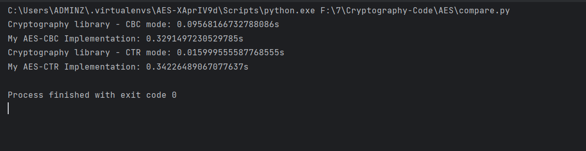

# Cài đặt AES với chế độ CBC và CTR 

## 1. Mã hóa AES 
- Chương trình sử dụng hàm AES của thư viện [pyaes](https://pypi.org/project/pyaes/).
- Thư viện cung cấp hàm `pyaes.AES(key).encrypt()` để mã hóa cho 1 khối 16-bit

### Cách sử dụng hàm AES trong thư viện `pyaes`

```python
import os
import pyaes

key_128 = os.urandom(16)
aes = pyaes.AES(key_128)

plaintext = "Hello World!!!!!"
plaintext_bytes = [ord(c) for c in plaintext]

ciphertext = aes.encrypt(plaintext_bytes)
print(repr(ciphertext))

decrypted = aes.decrypt(ciphertext)
decrypted_text = [chr(c) for c in decrypted]
print(repr(decrypted_text))
```

## 2. Cài đặt chế độ CBC
- Mã nguồn cài đặt padding và XOR được viết ở trong file `my_aes/utils.py` 
- Mã nguồn cài đặt chế độ CBC được viết ở trong file `my_aes/cbc_mode.py`, bao gồm hàm `encrypt_cbc_mode()` để mã hóa 
và `decrypt_cbc_mode()` để giải mã

### Hàm `encrypt_cbc_mode()`
- Tham số đầu vào: 
  - plaintext (String): thông điệp cần mã hóa
  - key (Bytes): khóa (128/192/256 bits)
  - iv (Bytes): initialization vector, có thể điền hoặc không
- Trả về:
  - iv (Bytes)
  - ciphertext (Bytes)

### Hàm `encrypt_cbc_mode()`
- Tham số đầu vào: 
  - ciphertext (Bytes): thông điệp cần giải mã
  - key (Bytes): khóa 
  - iv (Bytes): initialization vector
- Trả về:
  - plaintext (String)

## 3. Cài đặt chế độ CTR
- Cài đặt chế độ CTR tương tự với CBC với 2 hàm `encrypt_ctr_mode()` và `decrypt_cbc_mode()`

## 4. Kiểm tra cài đặt đúng so với thư viện [Cryptography](https://cryptography.io/en/latest/)
- Hai chế độ sau khi được cài đặt sẽ được tổng hợp trong file [my_aes/__init__.py](my_aes/__init__.py) để tiện sử dụng
- Mã nguồn kiểm tra kết quả mã hóa và giải mã của 2 chế độ CBC cà CTR được viết trong file [test.py](test.py) 
- Kết quả so sánh với thư viện Cryptography trả về là trùng khớp

## 5. Kết quả so sánh với thư viện [Cryptography](https://cryptography.io/en/latest/)
- Kết quả so sánh khi mã hóa và giải mã với dữ liệu trong file [plaintext.py](plaintext.py) 
khi sử dụng thư viện Cryptography so với tự cài đặt

